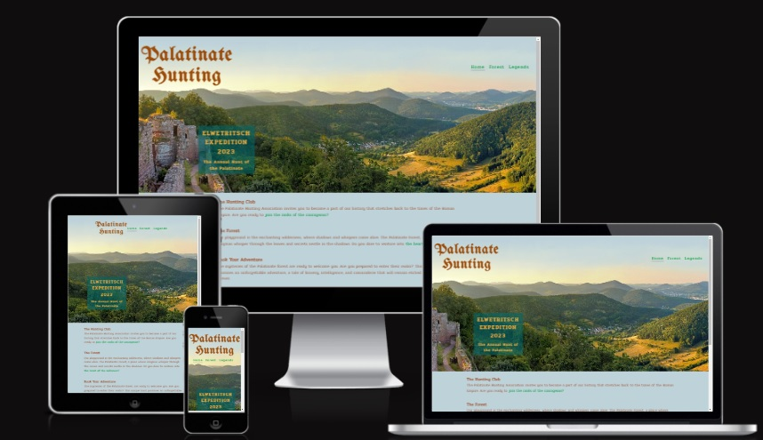
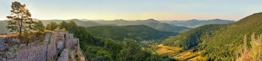
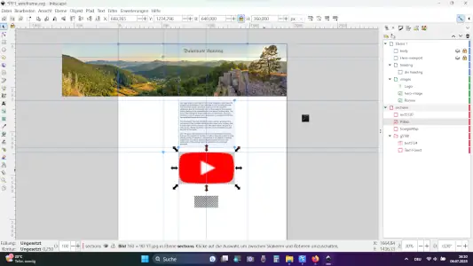
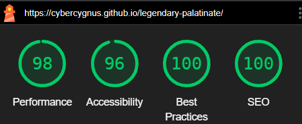
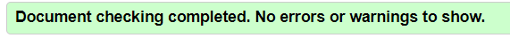

# Legendary Palatinate - a Journey through the Untold Legends of the Palatinate Forest

Welcome to Palatinate Hunting, a web project designed to immerse users in the enchanting mysteries and legends of the Palatinate Forest. My project aims to bring to life the rich folklore and captivating narratives surrounding this ancient woodland.

Through storytelling, a fictional hunting association invites you on an adventure deep into the heart of the Palatinate Forest. Discover the untold stories of mythical creatures, led by the legendary Eletrische, a majestic and elusive being that captures the imagination of hunters and nature enthusiasts alike.

## Live Website

[Palatinate Hunting](https://cybercygnus.github.io/legendary-palatinate/)

## Repository

[CyberCygnus @ Github](https://github.com/CyberCygnus/legendary-palatinate)

## Features

### Navigation bar

Featured on all HTML pages, the fully responsive navigation bar includes the logo which links to the top of the main page (rather than reloading the page for a better user experience) and a link to each section within the main page. This allows the user to easily navigate to their desired section without having to use the "back" button each time.
When hovered over, the colour of all links changes from green to violette, which enables the user to see which link they are selecting.

### The landing page image (hero-image)

The Hero-image is a photography taken from Wikipedia. It is a panorama view over the palatinate forest with a ruin of a castle.

### The Source Text

On the legends-page is an excerpt of Julius Caesars famous book about the Gallic War. The original Latin text is set side by side with the English translation. Both are scrollable.

### Registration Form

User can register and give feedback with a form.

### The Footer

The footer section includes links to social media sites.

## UX/UI

### User Stories

As a user of Legendary Palatinate, I expect:

1. **Visually Engaging Experience**: I want the website to immerse me in the world of the Palatinate Forest, with captivating visuals and a sense of adventure.
2. **Intuitive Navigation**: I want to be able to explore the website effortlessly, with clear menus and easy-to-use navigation elements.
3. **Understanding of the Legends**: I want to learn about the fascinating legends and mythical creatures associated with the Palatinate Forest, allowing me to delve deeper into its lore.
4. **Engaging Content**: I want the website to provide rich narratives and descriptions that spark my imagination.
5. **Educational Resources**: I want to access educational materials that provide insights into the history, traditions of the Palatinate.
6. **Interactivity**: I want to have the opportunity to interact with the website, ask questions, and provide feedback, fostering a sense of community and engagement.

### Site Goals and Initial Concept

The initial concept of Legendary Palatinate is to create a touristic website that emulates a real hunting club, aiming to attract tourists to the enchanting Palatinate Forest region. The website aims to provide an immersive experience, offering visitors the opportunity to explore the untold legends of the forest, learn about the mythical Elwetrisch creature, and be inspired to participate in hunting events. As the project evolves, it has the potential to become an information portal for the rich history, cultural events, hotels, and restaurants of the region, showcasing its ancient castles and ruins dating back to the Celts and Romans. By blending captivating storytelling, educational content, and interactive features, the website seeks to engage visitors and ignite their curiosity about the beauty of the Palatinate Forest.

### Technologies Used

- HTML & CSS
- Editor: Visual Studio Code, "Prettier"-extension from Microsoft
- Version Control: GitHub, GitHub-Desktop
- Fonts: Google-Fonts, Fontjoy
- Gimp: image cropping, scaling and creation.
- Inksape: wireframes
- Google Maps & YouTube API

### Languages

English
Latin for source-text

### Structure

The website consists of three pages:

- main page introduces the topics and links to the sub-pages.
- legends-page with three section:
  - about the club
  - a historic source text
  - a registration form
- forest-page with three sections
  - about the forest
  - touristic image video from YouTube
  - Google map of the region
  - additional lore about the "Elewetritsch"

### Colors

The design of Legendary Palatinate draws inspiration from the hero image, capturing the serene blue of the sky for the background color. This evokes calm and tranquility, complementing the lush greenery of the Palatinate Forest. The text color resembles old ink and wood, adding a touch of nostalgia. Links feature a saturated green, harmonizing with the forest and reinforcing the project's theme. A hover-over effect applies a stronger complement color, a saturated violet, for interactivity. This design aims to create an immersive and visually captivating experience

### Fonts

There are three fonts used in the website and they are imported from [Google Fonts](https://fonts.google.com/).

- _UnifrakturMaguntia_ - Only used for the page-titles. It gives the site a sense of old European history and folklore.
- _Cormorant Infant_ - Applied for introductory text and headings, to ensure readability while maintaing the historical feel of UnifrakturMaguntia.
- _Pridi_ - Used for body text, as a legible contrast, providing a balance between decorative and functional elements.

### Wireframes

I prefer a traditional approach to wireframing, starting with the simplicity of pen and paper to sketch out my initial ideas. Once I have a basic outline, I utilize Inkscape, a powerful vector graphics editor, to refine and add details to my wireframes.

## Testing

The website has been tested for responsiveness with Google-Inspect.

### Device testing

- Laptop: The website was tested on an Asus Vivobook 17" laptop, providing a comprehensive view of the website's layout and responsiveness. Additionally, a connected 37" monitor was utilized to evaluate the website's performance on larger screens.
- Mobile Phone: Testing also included mobile devices such as the Blackview smartphone, ensuring that the website functions optimally in both vertical and horizontal views. This guarantees a user-friendly experience for visitors accessing the site on their smartphones.
- Tablet: The website was tested on a Samsung Galaxy tablet to ensure proper display and functionality on tablet devices, optimizing the browsing experience for users who prefer this form factor.

### Accessibility

**Google Chrome Lighthouse**

### Performance

**Code Validators**

HTML:

- [w3-Validator - home](https://validator.w3.org/nu/?doc=https%3A%2F%2Fcybercygnus.github.io%2Flegendary-palatinate%2Findex.html)
- [w3-Validator - forest](https://validator.w3.org/nu/?doc=https%3A%2F%2Fcybercygnus.github.io%2Flegendary-palatinate%2Fforest.html)
- [w3-Validator - legends](https://validator.w3.org/nu/?doc=https%3A%2F%2Fcybercygnus.github.io%2Flegendary-palatinate%2Flegends.html)

CSS:

- [w3-jigsaw](https://jigsaw.w3.org/css-validator/validator?uri=https%3A%2F%2Fcybercygnus.github.io%2Flegendary-palatinate%2Fassets%2Fcss%2Fstyle.css&profile=css3svg&usermedium=all&warning=1&vextwarning=&lang=en)

## Deployment

The Legendary Palatinate website has been deployed using GitHub Pages. You can access the live version of the website [here](https://your-website-url).

### To deploy a GitHub repository to GitHub Pages, follow these steps:

1. Go to the "Settings" tab in your GitHub repository.
2. Select "Pages" from the left menu.
3. In the "Source" section, choose "Deploy from a branch" and select the branch you want to deploy (e.g., main).
4. Click "Save" to apply the changes.
5. GitHub will take a short while to publish the website. Once deployed, the URL will be displayed.

### If you would like to make changes to the repository without affecting the original, you can create a fork:

1. Log into GitHub and navigate to the repository.
2. Click the "Fork" button at the top of the screen to create a copy of the repository in your own GitHub account.

### To create a local clone of the repository for development or further modifications:

1. In the GitHub repository, click the "Code" button.
2. Under the "HTTPS" tab, click the clipboard icon to copy the repository's URL.
3. Open your preferred terminal or Git client.
4. Navigate to the desired directory where you want to create the clone.
5. Use the command `git clone [repository URL]` to clone the repository.
6. Press Enter, and the local clone will be created.

## Credits

- [Chrome DevTools](https://developer.chrome.com/docs/devtools/)
- [How to Properly Layout A Website - For Beginners](https://youtu.be/3C_22eBWpjg)

### Images

[hero-image.jpg](https://commons.wikimedia.org/wiki/File:Blick_in_den_Pf%C3%A4lzerwald_von_der_Burg_Neuscharfeneck.jpg)
[paper.png] own creation with Gimp (solid noise filter, seamless-tiling filter)

### Video

[YouTube - Holiday Region Trifelsland](https://youtu.be/OX94GDdwcn8) - Südliche Weinstrasse e.V.

### Fonts-Pairing

I used [Fontjoy](https://fontjoy.com/) to find suitable pairings of Google-Fonts.

### Code

- [The "Aspect Ratio Box" method](https://www.freecodecamp.org/news/responsive-web-design-how-to-make-a-website-look-good-on-phones-and-tablets/)
- Form based on course example (Coder's Coffeeshop).
- [Flexbox](https://www.w3schools.com/css/css3_flexbox.asp)
- [Media-queries](https://www.w3schools.com/css/css_rwd_mediaqueries.asp)

### Text Content

- Wikipedia
  - Palatinate Forest Nature Park
  - Palatinate Forest
  - Elwetritsch

## Future Features

I want to add images and more content.

## Acknowledgements

This website was created as a portfolio 1 project for the Full Stack Software Development course at [Code Institute](https://codeinstitute.net/). I would like to thank my mentor, [Harry Dhillon](https://github.com/Harry-Leepz), for the guidance and encouragement given throughout the project. Following his valuable feedback and advice, the website has been refined to be more intuitive and it has improved the overall user experience.

- [Markdown Cheatsheet by Adam Pritchard](https://github.com/adam-p/markdown-here/wiki/Markdown-Cheatsheet)
